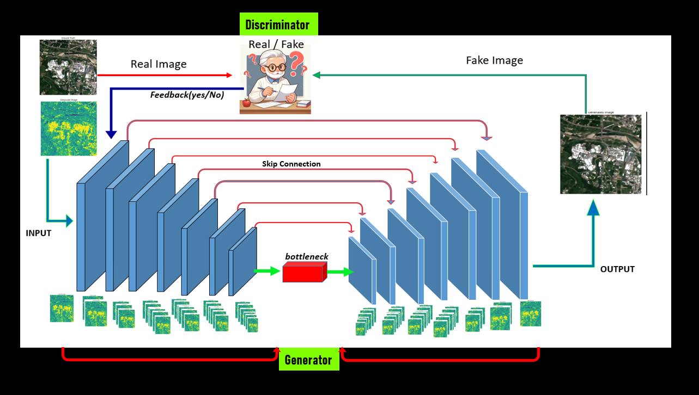
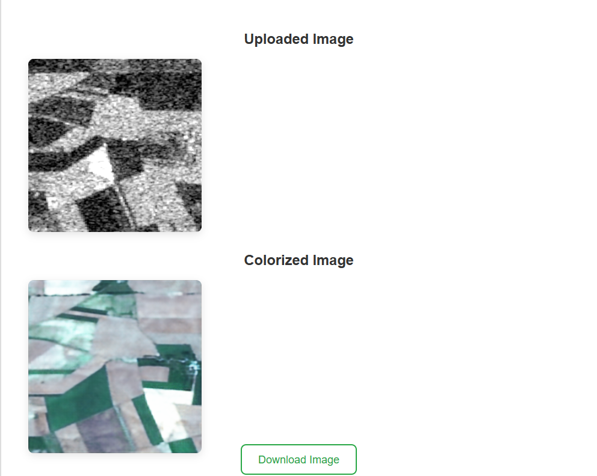

<h1>GAN Model for SAR Image Colorization</h1>

<h2>Model Diagram</h2>

The GAN model consists of two networks: a generator and a discriminator. The generator takes grayscale images and converts them into color images, while the discriminator evaluates the authenticity of the generated color images. Below is the architecture of the GAN model.

<!-- You will add the image of the model architecture here -->

        <!-- Section 2: User Interface -->
<h2>🧠Model Code🧠</h2>

    #Build generator and discriminator
    def build_generator(input_shape=(256, 256, 1)):
        inputs = Input(shape=input_shape)
        x = inputs

        # Encoder - Downsampling
        x1 = Conv2D(64, (3, 3), padding='same')(x)
        x1 = ReLU()(x1)
        x1 = Conv2D(64, (3, 3), padding='same')(x1)
        x1 = ReLU()(x1)
        p1 = tf.keras.layers.MaxPooling2D((2, 2))(x1)
    
        x2 = Conv2D(128, (3, 3), padding='same')(p1)
        x2 = ReLU()(x2)
        x2 = Conv2D(128, (3, 3), padding='same')(x2)
        x2 = ReLU()(x2)
        p2 = tf.keras.layers.MaxPooling2D((2, 2))(x2)
    
        x3 = Conv2D(256, (3, 3), padding='same')(p2)
        x3 = ReLU()(x3)
        x3 = Conv2D(256, (3, 3), padding='same')(x3)
        x3 = ReLU()(x3)
        p3 = tf.keras.layers.MaxPooling2D((2, 2))(x3)
    
        x4 = Conv2D(512, (3, 3), padding='same')(p3)
        x4 = ReLU()(x4)
        x4 = Conv2D(512, (3, 3), padding='same')(x4)
        x4 = ReLU()(x4)
        p4 = tf.keras.layers.MaxPooling2D((2, 2))(x4)
    
        # Additional Layer 1
        x5 = Conv2D(1024, (3, 3), padding='same')(p4)
        x5 = ReLU()(x5)
        x5 = Conv2D(1024, (3, 3), padding='same')(x5)
        x5 = ReLU()(x5)
        p5 = tf.keras.layers.MaxPooling2D((2, 2))(x5)
        
        # Additional Layer 2
        x6 = Conv2D(2048, (3, 3), padding='same')(p5)
        x6 = ReLU()(x6)
        x6 = Conv2D(2048, (3, 3), padding='same')(x6)
        x6 = ReLU()(x6)
      
        
        # Decoder - Upsampling
        u1 = Conv2DTranspose(1024, (3, 3), strides=(2, 2), padding='same')(x6)
        u1 = Concatenate()([u1, x5])
        u1 = Conv2D(1024, (3, 3), padding='same')(u1)
        u1 = ReLU()(u1)
        u1 = Conv2D(1024, (3, 3), padding='same')(u1)
        u1 = ReLU()(u1)
    
        u2 = Conv2DTranspose(512, (3, 3), strides=(2, 2), padding='same')(u1)
        u2 = Concatenate()([u2, x4])
        u2 = Conv2D(512, (3, 3), padding='same')(u2)
        u2 = ReLU()(u2)
        u2 = Conv2D(512, (3, 3), padding='same')(u2)
        u2 = ReLU()(u2)
    
        u3 = Conv2DTranspose(256, (3, 3), strides=(2, 2), padding='same')(u2)
        u3 = Concatenate()([u3, x3])
        u3 = Conv2D(256, (3, 3), padding='same')(u3)
        u3 = ReLU()(u3)
        u3 = Conv2D(256, (3, 3), padding='same')(u3)
        u3 = ReLU()(u3)
    
        u4 = Conv2DTranspose(128, (3, 3), strides=(2, 2), padding='same')(u3)
        u4 = Concatenate()([u4, x2])
        u4 = Conv2D(128, (3, 3), padding='same')(u4)
        u4 = ReLU()(u4)
        u4 = Conv2D(128, (3, 3), padding='same')(u4)
        u4 = ReLU()(u4)
    
        u5 = Conv2DTranspose(64, (3, 3), strides=(2, 2), padding='same')(u4)
        u5 = Concatenate()([u5, x1])
        u5 = Conv2D(64, (3, 3), padding='same')(u5)
        u5 = ReLU()(u5)
        u5 = Conv2D(64, (3, 3), padding='same')(u5)
        u5 = ReLU()(u5)
    
        outputs = Conv2D(3, (1, 1), activation='tanh')(u5)  # Output in range [-1, 1]
        model = tf.keras.models.Model(inputs, outputs)
        return model
    
        #build discriminator
        def build_discriminator(input_shape=(256, 256, 3)):
            inputs = Input(shape=input_shape)
            
            x = Conv2D(64, (3, 3), padding='same', strides=(2, 2))(inputs)
            x = LeakyReLU(alpha=0.2)(x)
            x = Dropout(0.3)(x)
        
            x = Conv2D(128, (3, 3), padding='same', strides=(2, 2))(x)
            x = LeakyReLU(alpha=0.2)(x)
            x = Dropout(0.3)(x)
        
            x = Conv2D(256, (3, 3), padding='same', strides=(2, 2))(x)
            x = LeakyReLU(alpha=0.2)(x)
            x = Dropout(0.3)(x)
        
            x = Conv2D(512, (3, 3), padding='same', strides=(2, 2))(x)
            x = LeakyReLU(alpha=0.2)(x)
            x = Dropout(0.3)(x)
        
            # Added two more layers
            x = Conv2D(1024, (3, 3), padding='same', strides=(2, 2))(x)
            x = LeakyReLU(alpha=0.2)(x)
            x = Dropout(0.3)(x)
        
            x = Conv2D(2048, (3, 3), padding='same', strides=(2, 2))(x)
            x = LeakyReLU(alpha=0.2)(x)
            x = Dropout(0.3)(x)
        
            x = Flatten()(x)
            x = Dense(1, activation='sigmoid')(x)
        
            model = tf.keras.models.Model(inputs, x)
            return model
    
<h2>➰➰Trainig Loop➰➰</h2>

    #Training loop
    def train(generator, discriminator, dataset, epochs, checkpoint_dir, batch_size=32, lambda_feat=10.0, lambda_gp=10.0):
        generator_optimizer = Adam(learning_rate=0.0002, beta_1=0.5)
        discriminator_optimizer = Adam(learning_rate=0.0004, beta_1=0.5)
        #Load from checkpoint if available
         #generator_optimizer, discriminator_optimizer = load_checkpoint(generator, discriminator, generator_optimizer, discriminator_optimizer, checkpoint_dir)
        for epoch in range(epochs):
            for real_images, real_targets in tqdm(dataset):
                batch_size = real_images.shape[0] 
                with tf.GradientTape() as gen_tape, tf.GradientTape() as disc_tape:
                    generated_images = generator(real_images, training=True)
                    real_output = discriminator(real_targets, training=True)
                    fake_output = discriminator(generated_images, training=True)
    
                    # Generator loss
                    gen_loss = custom_generator_loss(real_targets, generated_images, discriminator, lambda_feat)
    
                    # Discriminator loss
                    disc_loss = custom_discriminator_loss(real_output, fake_output, real_targets, generated_images, batch_size, discriminator, lambda_gp)
    
                generator_gradients = gen_tape.gradient(gen_loss, generator.trainable_variables)
                discriminator_gradients = disc_tape.gradient(disc_loss, discriminator.trainable_variables)
    
                generator_optimizer.apply_gradients(zip(generator_gradients, generator.trainable_variables))
                discriminator_optimizer.apply_gradients(zip(discriminator_gradients, discriminator.trainable_variables))
            
            if (epoch+1)%10==0:
                 # Save checkpoint and sample images every epoch
                generator.save(os.path.join(checkpoint_dir, f'generator.h5'))
                discriminator.save(os.path.join(checkpoint_dir, f'discriminator.h5'))
                 save_checkpoint(generator, discriminator, generator_optimizer, discriminator_optimizer, checkpoint_dir, epoch)
                # Save generated images to monitor progress
                save_images(generator, dataset, epoch, checkpoint_dir)
    
            print(f"Epoch [{epoch + 1}/{epochs}] completed. Generator loss: {gen_loss.numpy()}, Discriminator loss: {disc_loss.numpy()}")

    # Initialize and run training
    generator = build_generator()
    discriminator = build_discriminator()
    
    
    train(generator, discriminator, dataset, epochs=500, checkpoint_dir=checkpoint_dir)
<h2>⛔Loss Functions⛔</h2>

    #Custom loss functions
    def gradient_penalty(discriminator, real_images, fake_images, batch_size):
          alpha = tf.random.uniform([batch_size, 1, 1, 1], minval=0., maxval=1.)
          interpolated_images = alpha * real_images + (1 - alpha) * fake_images
          with tf.GradientTape() as tape:
              tape.watch(interpolated_images)
              interpolated_output = discriminator(interpolated_images, training=True)
          gradients = tape.gradient(interpolated_output, interpolated_images)
          norm = tf.sqrt(tf.reduce_sum(tf.square(gradients), axis=[1, 2, 3]))
          penalty = tf.reduce_mean((norm - 1.0) ** 2)
          return penalty
  
    def feature_matching_loss(real_images, generated_images, discriminator):
        real_features = discriminator.layers[-2](real_images, training=False)
        fake_features = discriminator.layers[-2](generated_images, training=False)
        return tf.reduce_mean(tf.square(real_features - fake_features))
    
    def custom_generator_loss(real_images, generated_images, discriminator, lambda_feat=10.0):
        mse_loss = tf.keras.losses.MeanSquaredError()(real_images, generated_images)
        feat_loss = feature_matching_loss(real_images, generated_images, discriminator)
        return mse_loss + lambda_feat * feat_loss
    
    def custom_discriminator_loss(real_output, fake_output, real_images, fake_images, batch_size, discriminator, lambda_gp=10.0, smooth_real=0.9, smooth_fake=0.1):
        real_labels = tf.ones_like(real_output) * smooth_real
        fake_labels = tf.zeros_like(fake_output) + smooth_fake
      
      real_loss = tf.keras.losses.BinaryCrossentropy(from_logits=True)(real_labels, real_output)
      fake_loss = tf.keras.losses.BinaryCrossentropy(from_logits=True)(fake_labels, fake_output)
      
      gp = gradient_penalty(discriminator, real_images, fake_images, batch_size)
      return real_loss + fake_loss + lambda_gp * gp

<h2>User Interface👥</h2>

The user interface allows you to upload grayscale images for colorization. The interface sends the images to the generator, which processes them and returns the colorized versions. Below is a screenshot of the interface.

            <!-- You will add the image of the user interface here -->

        <!-- Section 3: Output -->
<h2>Output</h2>

Once the GAN model colorizes the grayscale image, the output is displayed along with the original grayscale image and the ground truth (if available). Below is an example of the output generated by the GAN model.

            <!-- You will add the image of the generated output here -->

